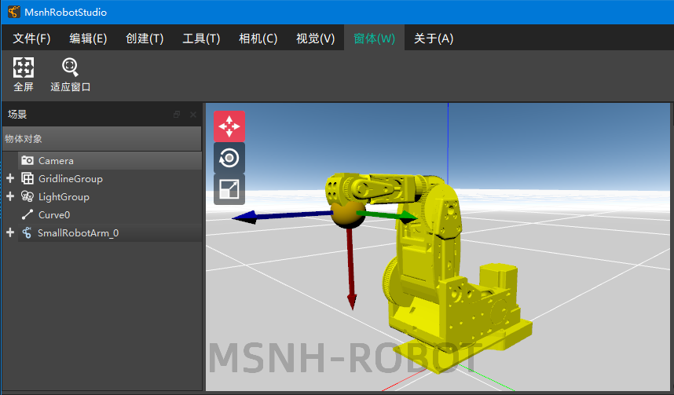
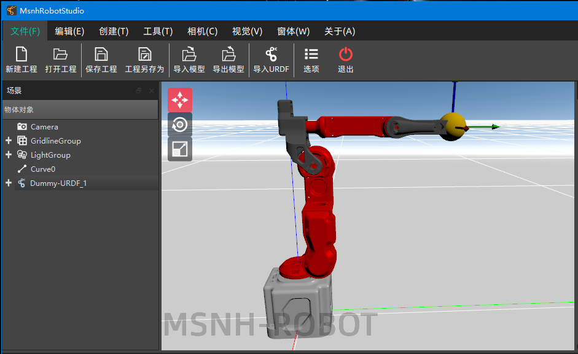
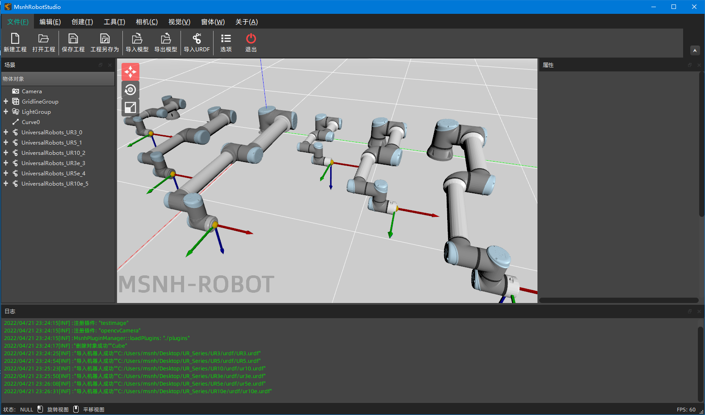
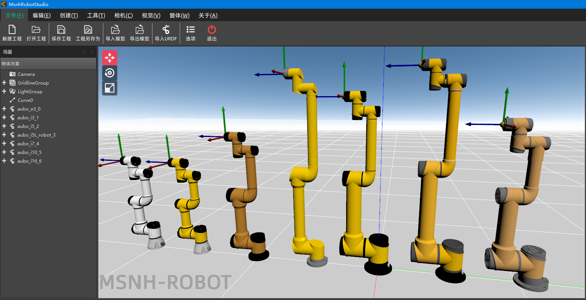

# 说明
此仓库包含了所有MsnhRobotStudio支持的机器人URDF文件与驱动。供大家科研与学习使用。
# 协议(仔细阅读)
此仓库包含的驱动文件不一定适应所有版本所有型号的机器人，请各位clone后仔细确认再使用。且如果使用类似UR等的工业机械臂，一定要在保证安全的情况下使用，如果出现异常情况请及时按下急停按钮！请各位严格按照每台机器人的安全规范操作，且保证机器人和人身安全，如果操作不当导致后果自负！请悉知！
# 目前支持机器人清单
- 1.SmallRobotArm

- 2.DummyRobot

- 3.UR系列

- 4.Aubo系列

# 也欢迎各位同学PR自己测试过的机器人(URDF+驱动)
# QQ交流群
287266905
